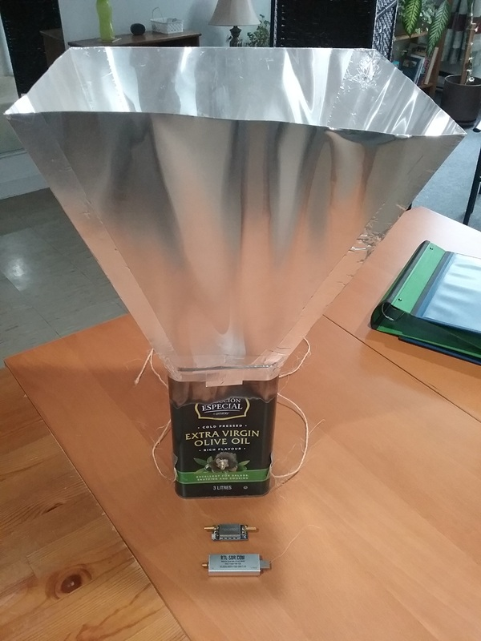
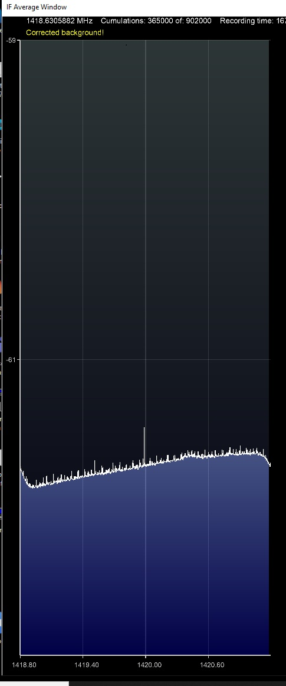

# Hydrogen-Line-Radio-Telescope

This project goal is to try to detect the Hydrogen Line
An antenna able to pick-up this frequency of approximately 1420 MHz need to be build.
A special filter used to collect only these frequency and reject unwanted ones.
A software define radio serve to measure a radio frequency spectrum.
Matlab is used to process the data and plot a picture.

## Antenna
An olive oil can was used. An sma connector installed inside. SMA coax cable used to connect.

## Filter

## Amplifier

## Software define radio

Here is an example of the resulting spetrum measured

## Matlab and data processing
Acquiring multiple spectrum capture over two days and ploting on time vertical axis using Matlab give the resulting imege.

