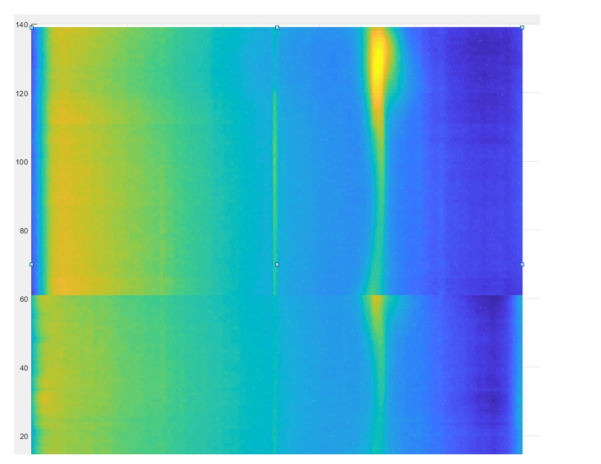

# 🌌 Hydrogen-Line Radio Telescope 

This project aims to **detect the Hydrogen Line**, a spectral emission at **1420 MHz** produced by neutral hydrogen in space.  
By capturing this signal, we can study the **structure of our galaxy** and explore the universe using radio astronomy.  

### 🛠️ Project Overview:  
✅ **Build an antenna** optimized for 1420 MHz reception  
✅ **Use a band-pass filter** to isolate the Hydrogen Line  
✅ **Employ a Software-Defined Radio (SDR)** for signal analysis  
✅ **Process the data with MATLAB** to generate visualizations  

---

## 📡 Antenna  
An **olive oil can** serves as a waveguide antenna, with an **SMA connector** installed inside.  
The antenna is connected via an **SMA coaxial cable** for signal transmission.  

  

---

## 🎛️ Band-Pass Filter  
A **dedicated filter** is used to **capture only the 1420 MHz signal** while rejecting interference from unwanted frequencies.  
The filter used is the model Nooelec SAWbird+ H1 Barebones - Premium SAW Filter & Cascaded Ultra-Low Noise Amplifier (LNA) Module for Hydrogen Line (21cm) Applications. 1420MHz Center Frequency
[https://www.nooelec.com/store/sawbird-h1-barebones.html?srsltid=AfmBOopjb-XtN-rLLxiDMEoBU-TggP4pCGwZvzOy0aJsINaHosNMAaT5](https://www.nooelec.com/store/sawbird-h1-barebones.html?srsltid=AfmBOopjb-XtN-rLLxiDMEoBU-TggP4pCGwZvzOy0aJsINaHosNMAaT5)  

---

## 🖥️ Software-Defined Radio (SDR)  
An SDR is used to **digitally process** the received signals, allowing fine-tuned frequency selection and spectrum visualization.  
Here the link to the model i used:
[https://www.rtl-sdr.com/buy-rtl-sdr-dvb-t-dongles/](https://www.rtl-sdr.com/buy-rtl-sdr-dvb-t-dongles/)  

📡 **Example of the measured Hydrogen Line spectrum:**  
  

---

## 📊 MATLAB & Data Processing  
By **capturing multiple spectrum measurements over two days** and plotting them over time, we generate a **waterfall plot**, revealing the Hydrogen Line as a distinct signal.  

📈 **Example of a processed waterfall plot:**  
  

---

### 🚀 Conclusion  
This project demonstrates that **with simple, low-cost equipment**, it is possible to detect a radio signal that has traveled across the galaxy for thousands of years. **Radio astronomy is within reach for DIY scientists and space enthusiasts!** 🛰️✨  

---

🎯 **Next Steps & Improvements:**  
- 🔊 **Audio Processing:** Convert radio signals into audible frequencies for a new perspective on data analysis.  
- 📶 **Advanced Filtering:** Improve signal isolation with better band-pass filters.  
- 🌍 **Global Collaboration:** Share data with other amateur radio astronomers for deeper insights.  

---

🔗 **Resources & References:**  
- 📚 NASA on the Hydrogen Line: [https://science.nasa.gov/](https://science.nasa.gov/)  
- 🔬 GNU Radio & SDR: [https://www.gnuradio.org/](https://www.gnuradio.org/)  
- 🛰️ Radio Astronomy Guide: [https://www.radioastronomy.com/](https://www.radioastronomy.com/)  

---

⭐ **If you like this project, don't forget to star this repository!** 🌟  

